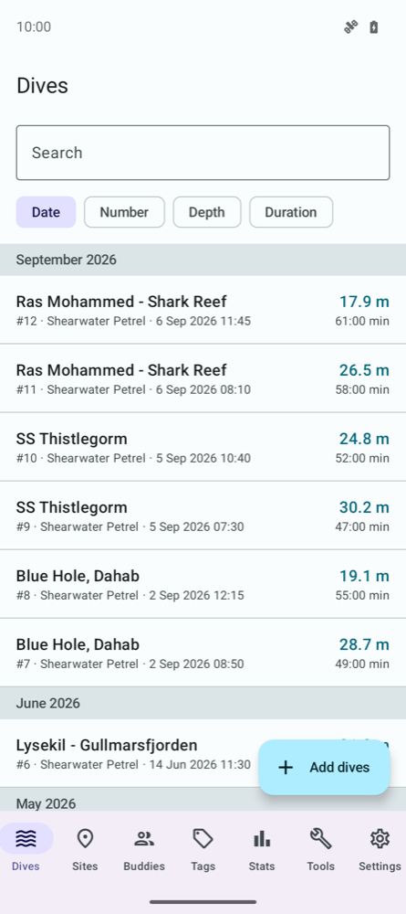
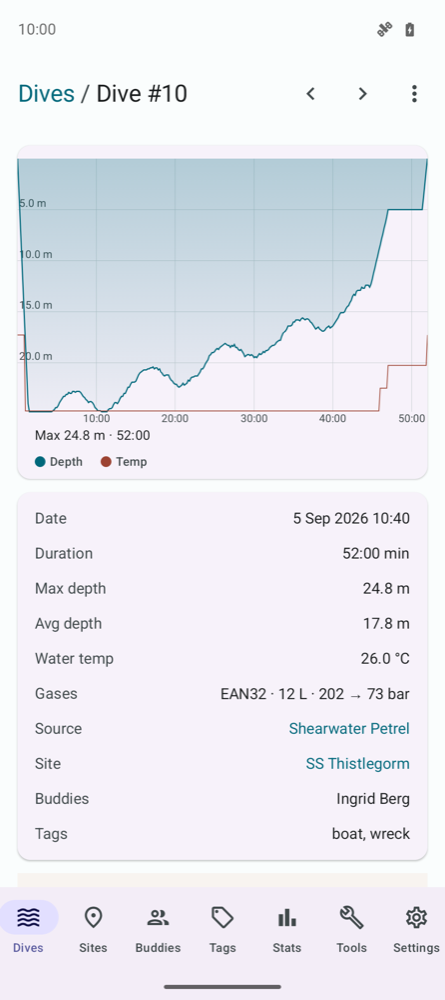
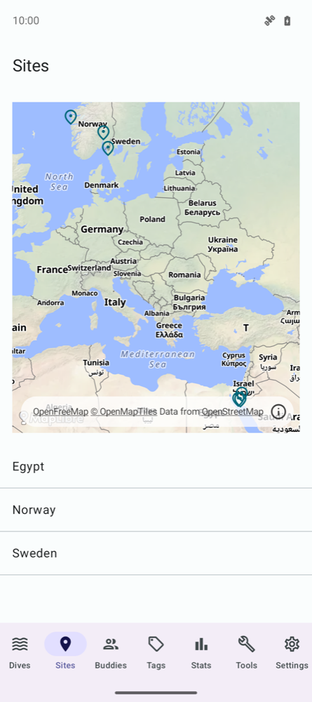
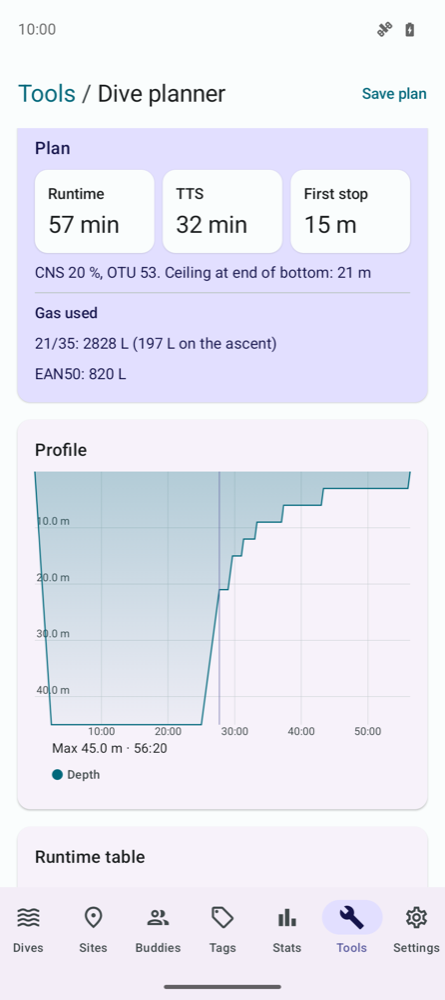

# Synth Divelog

A dive log for Android, desktop and iOS that downloads straight from your dive
computer.

Licence: [GPL-2.0-or-later](LICENSE). Files derived from Subsurface are GPL-2.0-only
and say so in their header.

## Features

- **Download from dive computers** (Android and desktop): Shearwater Predator and
  Petrel 1 over Bluetooth, Suunto Zoop/Vyper and HelO2/Vyper2 over the USB cable.
  New dives only, or a chosen number.
- **File import/export**: Subsurface XML, UDDF, MacDive XML and Shearwater Cloud
  databases. Duplicates are skipped, and the same dive from two computers is merged.
- **Subsurface cloud import/export** (Android and desktop).
- **Browse and edit**: dive profiles, search and sort, merge and split dives, sites
  on a map, buddies, tags, dive computers and statistics. Metric or imperial units.
- **Tools**: dive planner (Buhlmann ZHL-16C with gradient factors), gas blender for
  nitrox and trimix, tank buoyancy, and MOD/END.

<p>
  
  
  
  
</p>

## Development

Kotlin Multiplatform with Compose Multiplatform. Logic and UI are shared; each
platform adds a thin entry point.

| Module | Role |
|---|---|
| `:core:model` | Domain types and units. |
| `:core:db` | Database and repositories. |
| `:core:divecomputer` | Dive-computer protocols and parsers. |
| `:core:transport` | Bluetooth and serial transports (Android, desktop). |
| `:core:formats` | Logbook file formats. |
| `:core:gas` | The calculators behind the Tools tab. |
| `:core:logbook` | Import and export, cloud sync, downloads, settings. |
| `:ui` | Shared screens. |
| `:app:android`, `:app:desktop`, `iosApp/` | Platform entry points. |
| `build-logic/` | Gradle convention plugin for the shared modules. |

Protocol notes, written against real hardware, are in
[`docs/protocol/`](docs/protocol/README.md).

```sh
./gradlew jvmTest                     # tests (what CI runs)
./gradlew :app:android:assembleDebug  # Android debug APK
./gradlew :app:desktop:run            # desktop app

# iOS simulator (an Xcode build phase builds the Kotlin framework)
xcodebuild -project iosApp/iosApp.xcodeproj -scheme iosApp \
  -sdk iphonesimulator -configuration Debug \
  -destination 'platform=iOS Simulator,name=iPhone 17' build
```

Needs an Android SDK (`sdk.dir` in `local.properties` or `ANDROID_HOME`) and JDK 17
or newer to run Gradle. The desktop app and the shared UI's JVM target build on a
JDK 25 toolchain, which Gradle downloads if it is missing.

Store releases (Google Play, App Store) run from GitHub Actions; see
[`docs/release.md`](docs/release.md).
